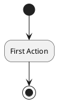

# 🐯 vtiger (preload)

This is where we discuss and decide once and for all how to implement preload in vtiger.

## What is 'preload'?

The 'preload' is a PHP section used to run code before every kind of requests and for all requests.
This is a middle stage between configuration file loading and application entrypoints.

